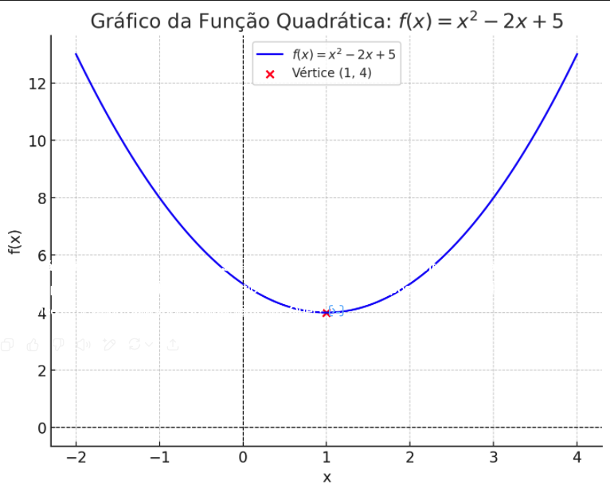

# 3.1.1 Domínio (Contradomínio) e Imagem

 
     📍
 Antes de estudar o comportamento gráfico e algébrico de uma função, é essencial entender dois conceitos fundamentais: **Domínio** e **Imagem** 🧭

## **🎯 Conceito:**
	O **Domínio** representa o conjunto de todos os valores possíveis que a **variável independente** de 𝑥 **pode** **assumir**, ou seja, todos os valores para os quais a função está definida e pode ser calculada.
	A **Imagem** corresponde **ao conjunto de todos os valores resultantes da função**, ou seja, todos os valores de 𝑓(𝑥) pode assumir ao aplicarmos os elementos do domínio.

	👉 **De forma simples:**
		* **Domínio** = "**O Conjunto de todos os possíveis valores de entrada (Valores de**  
     𝑥
 **) para os quais a função está definida**" **(O que posso colocar na função)**  
     ✅

 		* **Contradomínio** = "**É o conjunto de saída declarado na definição da função, mesmo que alguns desse valores nunca seja atingidos na pratica**" **(Onde a função premente entregar os resultados)** ✅**Imagem** = "**O subconjunto do contradomínio que contém os valores que a função realmente assume ao receber os elementos do domínio**" **(O que posso obter como resultado da função)** 🎯

	Esses conceitos são fundamentais para garantir que as operações matemáticas seja realizadas apenas dentro de condições válidas, evitando erros como divisão por zero, raízes de indicie par com radicando negativo.

	✅**Exemplo lógico:**
		Seja a função:
			 
     𝑓
  **:**  
     **ℝ**
  **→**  
     **ℝ**
 
		Com:
			 
     𝑓
 **(** 
     𝑥
 **) =**  
     𝑥
 **2**

		👉 Aqui:
			* **Domínio**: **ℝ** (Qualquer número real pode entrar como  
     𝑥 
 quando calculamos um polinômio 
     )

 			* **Contradomínio**: **ℝ** (Foi definida assim na declaração da função, ou seja, os resultados "prometem" estar nos reais)
			* **Imagem**: [0, +∞) (Por que a função  
     𝑥
 **2 **só devolve números reais positivos ou zero), se por acaso o nosso  
     𝑎 
 fosse negativo então seria (-∞, 0], lógico que tudo isso dependeria do valor final do  
     𝑓
 **(** 
     𝑥
 **).**
## ✍️ **Exemplo prático:**
	Determine o domínio, a imagem e faça um esboço do gráfico de:
		𝑓(𝑥) = x2 - 2x + 5.

	🤹‍♂️**Domínio:**
		👉A função dada é um polinômio de segundo graus (função quadrática)
		👉Polinômios **não tem restrição de domínio**, ou seja, você pode substituir qualquer valor real de 𝑥.
			✅ **Domínio:
				𝐷** 
     𝑓
  **= ℝ (Todos os números reais)

	🪞Imagem:**
		👉Para encontrar a imagem, precisamos analisar o comportamento da parábola.
			🧮**Passo 1: Identificar a concavidade:**
				O coeficiente de x2 é  
     𝑎
  = 1, que é positivo, então a parábola é volta para cima ⬆️.
			🧮**Passo 2: Encontrar o valor mínimo (ordenada do vértice):
				Vamos usar a fórmula de x do vértice:**
					𝑥 
     𝑣
  = -𝑏 / 2*𝑎
						𝑥 
     𝑣
  = -(-2) / 2*1
						🔎 Perceba que a fórmula trás consigo que 𝑏 tem que ser negativo, e o 𝑏 é negativo no polinômio, então o jogo de sinais deixa tudo positivo ("menos com menos é mais").
							𝑥 
     𝑣
  = 2 / 2
								𝑥 
     𝑣 
 = 1
								🔎Agora sabemos onde, horizontalmente nosso ponto de mínima(já que 𝑎 é positivo) está localizado, agora aplicaremos a fórmula onde está localizado o a mínima verticalmente.
			🧮**Passo 3: Aplicamos**  
     𝑓
 **(** 
     𝑥
  
     𝑣
 **) na função:**
				 
     𝑓
 **(** 
     𝑥
  
     𝑣
 **)** = x2 - 2x + 5
					 
     𝑓
 **(1)** = 12 - 2 ⋅ 1 + 5
						 
     𝑓
 **(1)** = 1 - 2 + 5
							 
     𝑓
 **(1)** = 4

		✅**Conclusão:**
			Com a parábola volta para cima, a imagem da função será todos os valores iguais ou acima de  
     𝑓
 (1) (em outras palavras, tudo que está acima do eixo y onde x = 1)
				✅ **Imagem:**
					 
     𝑓
 **(** 
     𝑥
 **) = 4	e	[4, +∞)**

	📈**Esboço:**
		* A parábola tem a concavidade para cima ✅
			🔎Dado que  
     𝑎
  é positivo
		* O vértice é o ponto (1, 4) ✅
			🔎Que foram respectivamente o x do vértice e o valor de y descoberto com o substituição de x da fórmula pelo valor de x do vértice
		* Como Δ = (-2)2 - 4(1)(5) = 4 - 20 == -16, **fazendo com que não exista raiz real**, ou seja, não carta o eixo x  
     ✅

 		* **O gráfico estará inteiramente acima do eixo x**  
     ✅

 
		👉Então, ao esboçar:
			* O ponto mais baixo é o vértice em (1, 4)
			* A curva se abre para cima
			* Não encosta nem cruza o eixo x.

